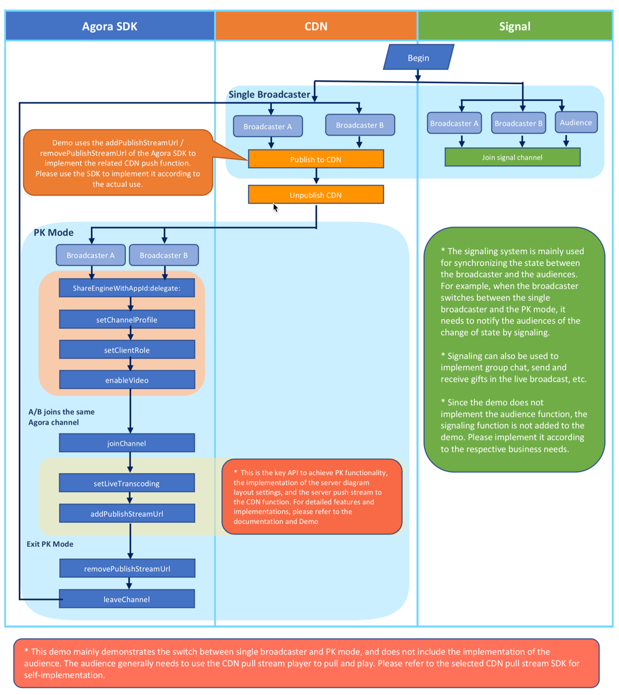

# ARD-Agora-Online-PK

# **Agora PK Hosting**

The Agora PK Hosting solution is designed for CDN Live push-and-pull stream scenarios that involve switching between the following scenarios:

- Co-hosting in Standard mode
- Co-hosting in PK mode

# Co-hosting in Standard Mode

The hosts can use third-party applications such as ijkplayer to push streams to CDN Live. The push stream address for the hosts are independent and the audience can only see the corresponding host.

# Co-hosting in PK Mode

The hosts need to quit the CDN Live push stream process, join the same Agora channel, and set the co-hosting composite mode on the Agora server using the _setLiveTranscoding_ API method; then push the composite stream to the original CDN address using the push stream _addPublishStreamUrl_ API method.

The CDN Live audience can then participate in the PK between the hosts. The CDN Live audience does not need to change the CDN Live URL address as the hosts will still use the previous CDN Live push stream URL address. When either one of the hosts quit the Agora channel, the other host will switch to the Standard mode.

# **Architectural Design**

You can find the Agora [implementation code](https://github.com/AgoraIO/ARD-Agora-Online-PK/tree/master/Agora-Online-PK-Android) for Android on Github. You can also download the [APK file](https://pan.baidu.com/share/init?surl=T7Psw5KxNkSsYRPiTTB7Dg) and request for a password by contacting [sales@Agora.io](mailto:sales@agora.io).

# **API methods**

The API methods related to the Agora Online PK：

iOS|Android
---|---
[sharedEngineWithAppId:delegate:](https://docs.agora.io/en/Interactive%20Broadcast/API%20Reference/oc/Classes/AgoraRtcEngineKit.html#//api/name/sharedEngineWithAppId:delegate:)|[create](https://docs.agora.io/en/Interactive%20Broadcast/API%20Reference/java/classio_1_1agora_1_1rtc_1_1_rtc_engine.html#a35466f690d0a9332f24ea8280021d5ed)
[setChannelProfile](https://docs.agora.io/en/Interactive%20Broadcast/API%20Reference/oc/Classes/AgoraRtcEngineKit.html#//api/name/setChannelProfile:)|[setChannelProfile](https://docs.agora.io/en/Interactive%20Broadcast/API%20Reference/java/classio_1_1agora_1_1rtc_1_1_rtc_engine.html#a1bfb76eb4365b8b97648c3d1b69f2bd6)
[setClientRole](https://docs.agora.io/en/Interactive%20Broadcast/API%20Reference/oc/Classes/AgoraRtcEngineKit.html#//api/name/setClientRole:)|[setClientRole](https://docs.agora.io/en/Interactive%20Broadcast/API%20Reference/java/classio_1_1agora_1_1rtc_1_1_rtc_engine.html#aa2affa28a23d44d18b6889fba03f47ec)
[enableVideo](https://docs.agora.io/en/Interactive%20Broadcast/API%20Reference/oc/Classes/AgoraRtcEngineKit.html#//api/name/enableVideo)|[enableVideo](https://docs.agora.io/en/Interactive%20Broadcast/API%20Reference/java/classio_1_1agora_1_1rtc_1_1_rtc_engine.html#a99ae52334d3fa255dfcb384b78b91c52)
[joinChannel](https://docs.agora.io/en/Interactive%20Broadcast/API%20Reference/oc/Classes/AgoraRtcEngineKit.html#//api/name/joinChannelByToken:channelId:info:uid:joinSuccess:)|[joinChannel](https://docs.agora.io/en/Interactive%20Broadcast/API%20Reference/java/classio_1_1agora_1_1rtc_1_1_rtc_engine.html#a8b308c9102c08cb8dafb4672af1a3b4c)
[setLiveTranscoding](https://docs.agora.io/en/2.3.1/product/Interactive%20Broadcast/API%20Reference/live_video_ios?platform=iOS#livetranscoding-ios)|[setLiveTranscoding](https://docs.agora.io/en/2.3.1/product/Interactive%20Broadcast/API%20Reference/live_video_android?platform=Android#setlivetranscoding)
[addPublishStreamUrl](https://docs.agora.io/en/2.3.1/product/Interactive%20Broadcast/API%20Reference/live_video_ios?platform=iOS#addpublishstreamurl-transcodingenabled)|[addPublishStreamUrl](https://docs.agora.io/en/2.3.1/product/Interactive%20Broadcast/API%20Reference/live_video_android?platform=Android#addpublishstreamurl)
[removePublishStreamUrl](https://docs.agora.io/en/2.3.1/product/Interactive%20Broadcast/API%20Reference/live_video_ios?platform=iOS#removepublishstreamurl)|[removePublishStreamUrl](https://docs.agora.io/en/2.3.1/product/Interactive%20Broadcast/API%20Reference/live_video_android?platform=Android#removepublishstreamurl)
[leaveChannel](https://docs.agora.io/en/Interactive%20Broadcast/API%20Reference/oc/Classes/AgoraRtcEngineKit.html#//api/name/leaveChannel:)|[leaveChannel](https://docs.agora.io/en/Interactive%20Broadcast/API%20Reference/java/classio_1_1agora_1_1rtc_1_1_rtc_engine.html#a2929e4a46d5342b68d0deb552c29d597)

# **Implementation**

- The Agora PK Hosting solution uses the Agora Video SDK in the communication mode.

- When switching to the PK mode from the Standard mode, each host needs to quit the original CDN Live stream and join the same Agora channel through the application logic.

- Under the PK mode:
1. Each host needs to set the composite configuration using the _setLiveTranscoding API method a_nd add the CDN Live push stream URL address, using the _addPublishStreamUrl API method,_ in the Agora channel.
2. The hosts need to ensure that the CDN Live push stream URL address will not change after switching from the Standard mode.
3. When either one of the hosts quit the Agora channel, the other host will quit the channel and switch to the Standard mode through the application.

- Before switching to the Standard mode from the PK mode:
1. Each host needs to remove the previous CDN Live push stream URL address using the _removePublishStreamUrl API_ method.
2. Each host needs to push the stream to the original CDN URL address.

# **Integration Guide**

# Integration SDK

- For Android, see [Configuring the DEV runtime](https://docs.agora.io/en/Interactive%20Broadcast/android_video?platform=Android).
- For IOS, see [Configuring the DEV runtime.](https://docs.agora.io/en/Interactive%20Broadcast/ios_video?platform=iOS)

# Switching Between the Co-hosting Standard Mode and Co-hosting PK Mode

_Android_:

1. [Video broadcasting realization](https://docs.agora.io/en/2.3.1/product/Interactive%20Broadcast/Quickstart%20Guide/broadcast_video_android?platform=Android)
2. [Stream pushing to CDN Live](https://docs.agora.io/en/2.3.1/product/Interactive%20Broadcast/Quickstart%20Guide/push_stream_android2.0?platform=Android)
3. Call the [_removePublishStreamUrl_](https://docs.agora.io/en/2.4/product/Interactive%20Broadcast/API%20Reference/live_video_android?platform=Android) API method to remove the stream URL address.

_IOS_:

1. [Video broadcasting realization](https://docs.agora.io/en/2.3.1/product/Interactive%20Broadcast/Quickstart%20Guide/broadcast_video_ios?platform=iOS)

1. [Stream pushing to CDN Live](https://docs.agora.io/en/2.3.1/product/Interactive%20Broadcast/Quickstart%20Guide/push_stream_ios2.0?platform=iOS)
2. Call the [_removePublishStreamUrl_](https://docs.agora.io/en/2.4/product/Interactive%20Broadcast/API%20Reference/live_video_ios?platform=iOS) API method to remove the stream URL address.

Ijkplayer Realization (Optional)

Android: See [&#39;Integration of ijkplayer framework for Android development&#39;](https://github.com/Bilibili/ijkplayer).
