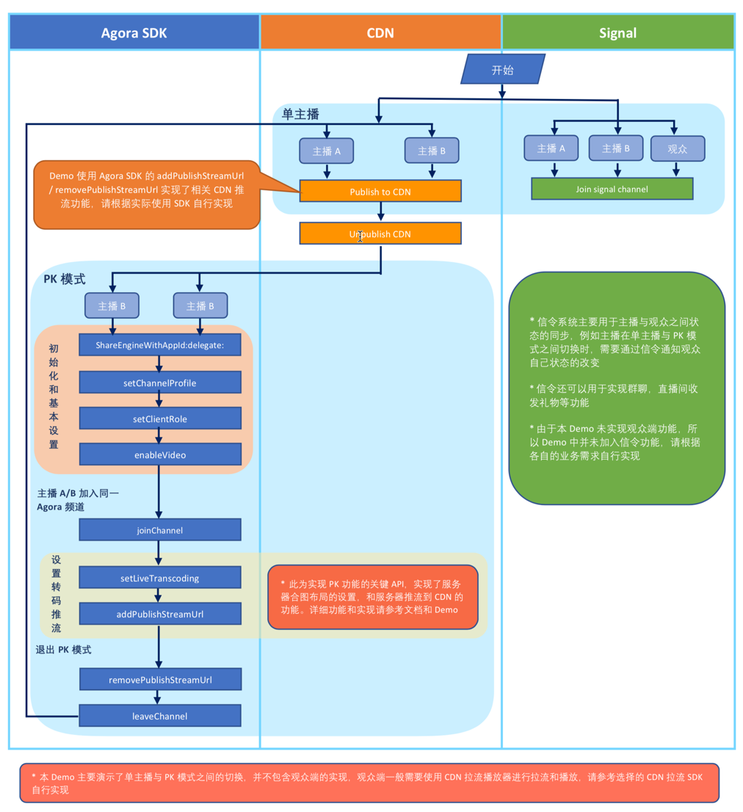

# PK 连麦

*Other Languages： [English](README.md)*

声网 PK 连麦方案场景针对 CDN 推流拉流场景设计，包含以下内容:

* 场景描述
* 架构设计
* 集成步骤
* 集成注意事项

## 场景描述

声网 PK 连麦场景针对 CDN 推流场景设计，主要涉及两种模式的切换：

* 单主播模式
* 双主播 PK 模式
* 观众模式（可选）

### 单主播模式

主播可以采用Agora SDK 或者第三方推流工具（比如 ijkplayer）推流到 CDN。观众通过 CDN 播放器拉取主播视频流观看直播。

### 双主播 PK 模式

两个主播退出 CDN 推流并同时加入同一个声网频道，各自在声网服务端设置双主播的合图（setLiveTranscoding），并通过声网提供的推流接口（addPublishStreamUrl）将合图后的流推送到原先的 CDN 地址。各自的 CDN 观众看到两个主播开始 PK。由于两个 PK 主播各自的 CDN 推流地址未发生改变，CDN 观众端不需要切换 CDN 拉流地址。只要任意一个主播离开声网 PK 频道，另一主播也退出 PK 模式返回普通模式。

### 观众模式（可选）

观众一般使用第三方 CDN 播放器（比如 ijkplayer）拉取视频流观看直播，本示例程序中并不包含观众模式。

## 架构设计

下图为一起 PK 连麦场景的声网实现架构图：


声网已在 GitHub 提供了 Android 平台的 [实现代码](https://github.com/AgoraIO/ARD-Agora-Online-PK/tree/master/Agora-Online-PK-Android)。你也可以下载实现的 [apk 文件](https://pan.baidu.com/s/1T7Psw5KxNkSsYRPiTTB7Dg) 下载密码请联系声网客服 sales@agora.io 。

## API 列表
示例 App 的 API 流程如下图所示。


Agora SDK 关键 API 列表：

iOS|Android
---|---
[sharedEngineWithAppId:delegate:](https://docs.agora.io/cn/Interactive%20Broadcast/API%20Reference/oc/Classes/AgoraRtcEngineKit.html#//api/name/sharedEngineWithAppId:delegate:)|[create](https://docs.agora.io/cn/Interactive%20Broadcast/API%20Reference/java/classio_1_1agora_1_1rtc_1_1_rtc_engine.html#a35466f690d0a9332f24ea8280021d5ed)
[setChannelProfile](https://docs.agora.io/cn/Interactive%20Broadcast/API%20Reference/oc/Classes/AgoraRtcEngineKit.html#//api/name/setChannelProfile:)|[setChannelProfile](https://docs.agora.io/cn/Interactive%20Broadcast/API%20Reference/java/classio_1_1agora_1_1rtc_1_1_rtc_engine.html#a1bfb76eb4365b8b97648c3d1b69f2bd6)
[setClientRole](https://docs.agora.io/cn/Interactive%20Broadcast/API%20Reference/oc/Classes/AgoraRtcEngineKit.html#//api/name/setClientRole:)|[setClientRole](https://docs.agora.io/cn/Interactive%20Broadcast/API%20Reference/java/classio_1_1agora_1_1rtc_1_1_rtc_engine.html#aa2affa28a23d44d18b6889fba03f47ec)
[enableVideo](https://docs.agora.io/cn/Interactive%20Broadcast/API%20Reference/oc/Classes/AgoraRtcEngineKit.html#//api/name/enableVideo)|[enableVideo](https://docs.agora.io/cn/Interactive%20Broadcast/API%20Reference/java/classio_1_1agora_1_1rtc_1_1_rtc_engine.html#a99ae52334d3fa255dfcb384b78b91c52)
[joinChannel](https://docs.agora.io/cn/Interactive%20Broadcast/API%20Reference/oc/Classes/AgoraRtcEngineKit.html#//api/name/joinChannelByToken:channelId:info:uid:joinSuccess:)|[joinChannel](https://docs.agora.io/cn/Interactive%20Broadcast/API%20Reference/java/classio_1_1agora_1_1rtc_1_1_rtc_engine.html#a8b308c9102c08cb8dafb4672af1a3b4c)
[setLiveTranscoding](https://docs.agora.io/cn/2.3.1/product/Interactive%20Broadcast/API%20Reference/live_video_ios?platform=iOS#livetranscoding-ios)|[setLiveTranscoding](https://docs.agora.io/cn/2.3.1/product/Interactive%20Broadcast/API%20Reference/live_video_android?platform=Android#setlivetranscoding)
[addPublishStreamUrl](https://docs.agora.io/cn/2.3.1/product/Interactive%20Broadcast/API%20Reference/live_video_ios?platform=iOS#addpublishstreamurl-transcodingenabled)|[addPublishStreamUrl](https://docs.agora.io/cn/2.3.1/product/Interactive%20Broadcast/API%20Reference/live_video_android?platform=Android#addpublishstreamurl)
[removePublishStreamUrl](https://docs.agora.io/cn/2.3.1/product/Interactive%20Broadcast/API%20Reference/live_video_ios?platform=iOS#removepublishstreamurl)|[removePublishStreamUrl](https://docs.agora.io/cn/2.3.1/product/Interactive%20Broadcast/API%20Reference/live_video_android?platform=Android#removepublishstreamurl)
[leaveChannel](https://docs.agora.io/cn/Interactive%20Broadcast/API%20Reference/oc/Classes/AgoraRtcEngineKit.html#//api/name/leaveChannel:)|[leaveChannel](https://docs.agora.io/cn/Interactive%20Broadcast/API%20Reference/java/classio_1_1agora_1_1rtc_1_1_rtc_engine.html#a2929e4a46d5342b68d0deb552c29d597)

## 集成步骤

### PK 连麦方案场景实现

**PK 场景需要实现以下功能：**

1. 集成声网 SDK 实现视频直播
	* Android, 详见 [集成客户端](https://docs.agora.io/cn/Interactive%20Broadcast/android_video?platform=Android)
	* iOS, 详见 [集成客户端](https://docs.agora.io/cn/Interactive%20Broadcast/ios_video?platform=iOS)

2. 实现 CDN 推流，和服务器合图
 	* Android, 详见 [推流到 CDN ](https://docs.agora.io/cn/Interactive%20Broadcast/push_stream_android2.0?platform=Android)
	* iOS, 详见 [推流到 CDN ](https://docs.agora.io/cn/Interactive%20Broadcast/push_stream_ios2.0?platform=iOS)

3. 实现第三方推流，拉流（可选）
	* 如单主播模式需要使用第三方推流工具，需要自行集成第三方推流。
	* 如 APP 需要实现观众模式，需要自行集成第三方拉流播放器。

### 实现细节

* 声网 PK 连麦方案采用直播模式的 Agora Video SDK。
* 从单主播模式进入 PK 模式时，每个主播都需要退出原来的旁路推流。
* 从单主播模式进入 PK 模式时，各位主播需要同时加入同一声网频道，可由 APP 控制实现。
* PK 模式下，每个主播都需要设置合图（setLiveTranscoding，[Android](https://docs.agora.io/cn/Interactive%20Broadcast/API%20Reference/java/classio_1_1agora_1_1rtc_1_1_rtc_engine.html#a3cb9804ae71819038022d7575834b88c),  [iOS](https://docs.agora.io/cn/2.3.1/product/Interactive%20Broadcast/API%20Reference/live_video_ios?platform=iOS#livetranscoding-ios)）, 并重新添加 CDN 推流地址（addPublishStreamUrl，[Android](https://docs.agora.io/cn/Interactive%20Broadcast/API%20Reference/java/classio_1_1agora_1_1rtc_1_1_rtc_engine.html#a4445b4ca9509cc4e2966b6d308a8f08f),  [iOS](https://docs.agora.io/cn/Interactive%20Broadcast/API%20Reference/oc/Classes/AgoraRtcEngineKit.html#//api/name/addPublishStreamUrl:transcodingEnabled:)）
* PK 模式下，设置合图（setLiveTranscoding）和添加 CDN 推流地址（addPublishStreamUrl）需要在声网频道内进行。
* PK 模式下，双方主播的 CDN 推流地址应与普通模式时选用的 URL 地址一致确保 CDN 观众无需切换 CDN 地址。
* PK 模式下，只要有一位主播退出声网频道，其余主播也同时退出声网频道进入单主播模式，可由 APP 控制实现。
* 从 PK 模式进入单主播模式前，每个主播都需要移除原先的 CDN 推流地址（removePublishStreamUrl，[Android](https://docs.agora.io/cn/Interactive%20Broadcast/API%20Reference/java/classio_1_1agora_1_1rtc_1_1_rtc_engine.html#a87b3f2f17bce8f4cc42b3ee6312d30d4),  [iOS](https://docs.agora.io/cn/Interactive%20Broadcast/API%20Reference/oc/Classes/AgoraRtcEngineKit.html#//api/name/removePublishStreamUrl:)）。
* 从 PK 模式进入普通模式时，每个主播需要重新向原来的 CDN 地址推流确保 CDN 观众无需切换地址。

### 运行示例程序

首先在 [Agora.io 注册](https://dashboard.agora.io/cn/signup/) 注册账号，并创建自己的测试项目，获取到 AppID。
然后在 [Agora.io SDK](https://docs.agora.io/cn/Interactive%20Broadcast/downloads) 下载 视频通话/视频直播 SDK

**iOS**

1. 将 AppID 填写进 KeyCenter.m

	```
	static let AppId: String = "Your App ID"
	```

2. 解压视频通话/视频直播 SDK 包，将其中的 libs/AgoraRtcEngineKit.framework 复制到项目文件夹下。
3. 最后使用 XCode 打开 Agora-Online-PK.xcodeproj，连接 iPhone／iPad 测试设备，设置有效的开发者签名后即可运行。

	```
	* XCode 9.0 +
	* iOS 9.0 真机设备
	* 不支持模拟器
	```

**Android**

1. 将 AppID 填写进 PKConstants 的 MEDIA_APP_ID以及SIGNALING_APP_ID 中
2. 解压视频通话/视频直播 SDK 包，将其中的jar和so复制到项目对应文件夹下。
3. 最后使用 AndroidStudio 打开项目，连接 Android 测试设备，编译并运行。

	```
	* Android Studio 2.0 +
	* minSdkVersion 16
	* 部分模拟器会存在功能缺失或者性能问题，所以推荐使用真机设备
	```

### 示例程序功能
- 开始直播：在首页输入直播频道名，点击“开始直播”按钮，进入直播房间，开始直播和 CDN 推流；
- 发起PK：在房间内点击“PK”按钮，并输入“PK房间名”进入PK（需要两个主播同时输入相同的“PK房间名”以进入同一房间）；
- 退出PK：点击“退出PK”按钮，退出PK模式，返回单主播模式；
- 退出房间：点击右上角“离开”按钮，离开直播房间；
- 拷贝拉流地址：在直播中可点击“拷贝”按钮，拷贝拉流地址，使用 CDN 播放器（如 VLC）

## 集成注意事项
- 单主播模式与 PK 模式切换时一定要先停止原先的推流，再重新开始推流，否则会推流失败
- 观众一般需要感知主播模式的改变来更新UI，一般是通过信令通知观众，由于信令和 CDN 视频流存在时间差（CDN 推流一般存在数秒的延迟），为了更好的用户体验，可以在切换模式时做一个延时动画，让用户忽略这个时间差。也可以通过 CDN 播放器的特有回调（如视频尺寸改变）来感知主播状态的变化。

## 联系我们

- 如果发现了示例程序的 bug，欢迎提交 [issue](https://github.com/AgoraIO/ARD-Agora-Online-PK/issues)
- 声网 SDK 完整 API 文档见 [文档中心](https://docs.agora.io/cn/)
- 如果在集成中遇到问题，你可以到 [开发者社区](https://dev.agora.io/cn/) 提问
- 如果有售前咨询问题，可以拨打 400 632 6626，或加入官方Q群 12742516 提问
- 如果需要售后技术支持，你可以在 [Agora Dashboard](https://dashboard.agora.io) 提交工单

## 代码许可

The MIT License (MIT).